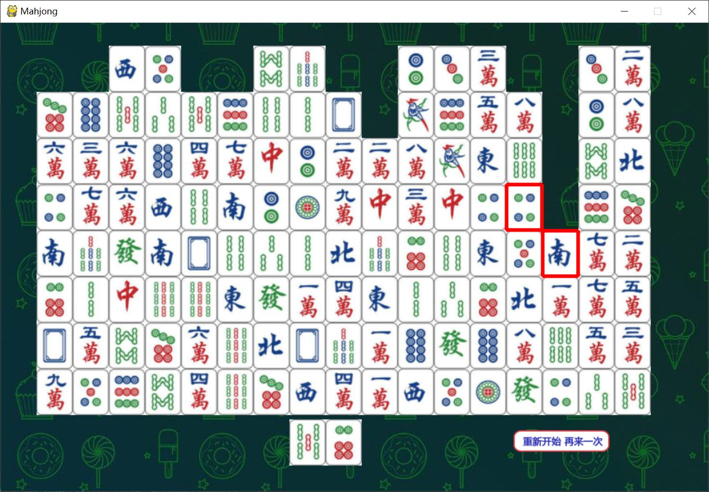

# Mahjong Draw
A Mahjong Draw Game written for my grandparents.

### Rule
There are 136 tiles in Mahjong. In this game, tiles are ordered in rectangular 17*8 board.
That is, there are 17 columns, in each column, there are 8 tiles.

The first tile of one column is called **Head**.

If there two columns that have the same Head, these two Heads can be eliminated from the board.
If no Head can be eliminated, you can draw a tile in your hand and continue eliminating Heads.
Besides, the tile in your hand can be eliminated with a Head if they are same.

You can at most have three tiles in your hand, or you fail the game.
If all tiles are eliminated, then you succeed.

### Screenshot

### Use
Run `$python mahjong.py`

Click the left button of your mouse to select tiles that can be eliminated. Click the right button to draw a tile.

### TODO :triangular_flag_on_post:
* [x] Add game over Effects
* [x] Add Elimination Effects
* [x] Add replay
* [ ] Starting GUI.